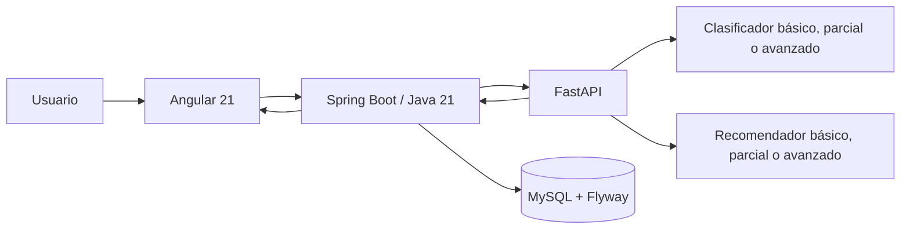

# Arquitectura y flujo

Spring valida la solicitud y FastAPI selecciona un nivel según la presencia de cinco campos avanzados. Cero campos usa el modelo básico, uno a cuatro usa el parcial y cinco usa el avanzado. No se inventan valores ausentes.

FastAPI retorna categoría, probabilidad, recomendaciones estructuradas, confianza, factores clave, nivel y versiones. Spring conserva esa estructura y la persiste. Si FastAPI falla: en desarrollo (`fallback-enabled=true`) Spring aplica reglas deterministas y marca `origen_prediccion=fallback_reglas` — nunca presenta el fallback como inferencia ML —; en producción (`fallback-enabled=false`) la API responde `503 MODELO_API_NO_DISPONIBLE` y no enmascara la caída del modelo.

## Contrato de recomendación

Cada recomendación contiene:

- `codigo`: identificador estable.
- `texto`: acción presentada al usuario.
- `confianza`: probabilidad del recomendador; es nula en reglas de respaldo.
- `factores_clave`: hechos del registro que explican la acción.

La lista de textos original se conserva para compatibilidad con clientes y registros anteriores.
